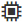

= SANtricity System Managerでシェルフコンポーネントのステータスと設定を表示する
:allow-uri-read: 
:experimental: 
:icons: font
:imagesdir: ../media/

[role="lead"]
ハードウェアページには、電源装置、ファン、バッテリなど、シェルフコンポーネントのステータスと設定が表示されます。

.このタスクについて
使用可能なコンポーネントはシェルフのタイプによって異なります。

* *ドライブシェルフ*--ドライブ、電源/ファンキャニスター、入出力モジュール（IOM）、およびその他のサポートコンポーネントが1台のシェルフに収容されます。
* *コントローラシェルフ*--一連のドライブ、1つまたは2つのコントローラキャニスター、電源/ファンキャニスター、およびその他のサポートコンポーネントが1つのシェルフに格納されています。

.手順
. 「 * ハードウェア * 」を選択します。
. コントローラシェルフまたはドライブシェルフのドロップダウンリストを選択し、* View Settings *を選択します。
+
Shelf Components Settingsダイアログボックスが開き、シェルフコンポーネントに関連するステータスと設定がタブに表示されます。選択したシェルフのタイプによっては、次の表に示す一部のタブが表示されない場合があります。

+
[cols="25h,~"]
|===
| タブをクリックする | 説明 

 a| 
シェルフ
 a| 
[* Shelf *]タブには、次のプロパティが表示されます。

** * Shelf ID *：ストレージ・アレイ内のシェルフを一意に識別しますこの番号はコントローラファームウェアによって割り当てられますが、変更するにはメニューから「Shelf [Change ID]」を選択します。
** * Shelf path redundancy *-シェルフとコントローラ間の接続の代替方法があるかどうか（「はい」または「いいえ」）を示します。
** *現在のドライブタイプ*--ドライブに組み込まれているテクノロジのタイプを表示します(たとえば'セキュリティ対応のSASドライブ)ドライブタイプが複数ある場合は、両方のテクノロジが表示されます。
** * Serial Number *-シェルフのシリアル番号が表示されます。

 a| 
IOM（ESM）
 a| 
IOM（ESM）*タブには、環境サービスモジュール（ESM）とも呼ばれる入出力モジュール（IOM）のステータスが表示されます。ドライブシェルフ内のコンポーネントのステータスを監視し、ドライブトレイとコントローラ間の接続ポイントとして機能します。

ステータスは最適、失敗、最適（誤配線）、未認定のいずれかです。その他の情報には、ファームウェアのバージョンと構成設定のバージョンが含まれます。

「*詳細設定を表示*」を選択すると、最大および現在のデータレートとカード通信の状態（「はい」または「いいえ」）が表示されます。

[NOTE]
====
このステータスは、IOMアイコンを選択して確認することもできます をクリックします。

====

 a| 
電源装置
 a| 
電源装置*タブには、電源装置キャニスターと電源装置自体のステータスが表示されます。ステータスは最適、失敗、取り外し、不明のいずれかです。電源装置のパーツ番号も表示されます。

[NOTE]
====
電源装置アイコンを選択して、このステータスを確認することもできます image:../media/sam1130-ss-hardware-power-icon.gif[""]をクリックします。

====

 a| 
ファン
 a| 
ファン*タブには、ファンキャニスターとファン自体のステータスが表示されます。ステータスは最適、失敗、取り外し、不明のいずれかです。

[NOTE]
====
ファンアイコンを選択して、このステータスを確認することもできます image:../media/sam1130-ss-hardware-fan-icon.gif[""]をクリックします。

====

 a| 
温度
 a| 
温度*タブには、センサー、コントローラ、電源/ファンキャニスターなどのシェルフコンポーネントの温度ステータスが表示されます。ステータスは最適、公称温度を超過、最大温度を超過、不明のいずれかです。

[NOTE]
====
温度アイコンを選択して、このステータスを表示することもできます image:../media/sam1130-ss-hardware-temp-icon.gif[""]をクリックします。

====

 a| 
電池
 a| 
バッテリ*タブには、コントローラのバッテリのステータスが表示されます。ステータスは最適、失敗、取り外し、不明のいずれかです。その他の情報には、バッテリの寿命、交換までの日数、学習サイクル、および学習サイクル間の週の数が含まれます。

[NOTE]
====
このステータスは、バッテリアイコンを選択して確認することもできます image:../media/sam1130-ss-hardware-battery-icon.gif[""]をクリックします。

====

 a| 
SFP
 a| 
[SFP *]タブには、コントローラのSmall Form-factor Pluggable（SFP）トランシーバのステータスが表示されます。ステータスは最適、失敗、不明のいずれかです。

[Show more settings]を選択して、SFPのパーツ番号、シリアル番号、ベンダーを確認します。

[NOTE]
====
このステータスは、SFPアイコンを選択して確認することもできます をクリックします。

====
|===
. [* 閉じる * ] をクリックします。

