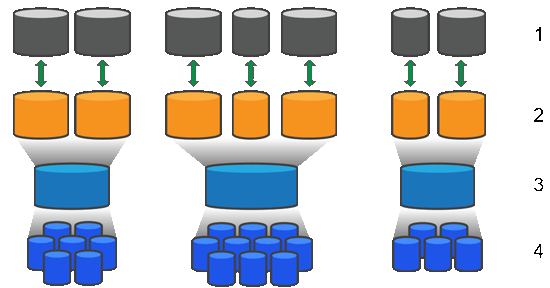

= SANtricity ソフトウェアにおけるプールとボリュームグループの仕組み
:allow-uri-read: 
:icons: font
:imagesdir: ../media/

[role="lead"]
ストレージをプロビジョニングするには、ストレージアレイで使用するハードディスクドライブ（HDD）またはソリッドステートディスク（SSD）ドライブを含むプールまたはボリュームグループを作成します。

物理ハードウェアは、データを整理して簡単に取得できるように、論理コンポーネントにプロビジョニングされます。次の2種類のグループ化がサポートされています。

* プール
* RAIDボリュームグループ

プールとボリュームグループは、ストレージアレイ内の最上位のストレージ単位であり、ドライブの容量を管理可能な区分に分割します。これらの論理区分内に、データが格納される個々のボリュームまたはLUNがあります。次の図に、この概念を示します。

^1 ^ホストLUN；^2^ボリューム；^3^ボリュームグループまたはプール；^4^ HDDまたはSSDドライブ

ストレージシステムを導入したら、まず次の処理を実行して使用可能なドライブ容量をさまざまなホストに提供します。

* 十分な容量のプールまたはボリュームグループを作成しています
* パフォーマンス要件を満たすために必要な数のドライブをプールまたはボリュームグループに追加します
* 特定のビジネス要件を満たすために必要なレベルのRAID保護（ボリュームグループを使用している場合）を選択

同じストレージシステム上にプールまたはボリュームグループを複数作成することはできますが、1本のドライブを複数のプールまたはボリュームグループに所属させることはできません。その後、プールまたはボリュームグループのスペースを使用して、I/O用にホストに表示されるボリュームが作成されます。

[[pools]]
== プール

プールは、物理ハードディスクドライブを1つの大きなストレージスペースに集約し、RAID保護を強化するために設計されています。プールに割り当てられたドライブをすべて使用して多数の仮想RAIDセットを作成したり、プールを構成する全ドライブにデータを均等に分散することができます。ドライブを減らしたり追加したりした場合、System Managerによってアクティブなドライブ全体にわたってデータの再分散が動的に実行されます。

プール機能はワンランク上のRAIDとして機能します。基盤となるRAIDアーキテクチャが仮想化されるため、リビルド、ドライブ拡張、ドライブ障害への対応といったタスクの処理に最適なパフォーマンスと柔軟性が提供されます。System Managerは、8+2構成（8本のデータディスクと2本のパリティディスク）ではRAIDレベルを自動的に6に設定します。

[[drive-matching]]
=== ドライブが一致しません

プールにはHDDまたはSSDのいずれかを選択できます。ただし、ボリューム グループと同様に、プール内のすべてのドライブが同じテクノロジを使用する必要があります。どのドライブを含めるかは、コントローラが自動的に選択するため、選択したドライブ タイプに対して十分な数のドライブを確保する必要があります。EF80およびEF50システムでは、Performance NVMe SSDおよびCapacity NVMe SSDは別々のドライブタイプとして扱われます。これらは同じストレージアレイ内で共存できますが、別々のプールに配置する必要があります。

[[managing-failed-drives]]
=== 障害ドライブの管理

プールには最低 11 ドライブの容量がありますが、1 ドライブ分の容量は、ドライブ障害が発生した場合のスペア容量として予約されています。このスペア容量は「`保存容量`」と呼ばれます。EF80 および EF50 システムでは、パフォーマンス プールには最低 6 台のドライブが必要で、容量プールには最低 12 台のドライブが必要です。Capacity-DDP プールの場合、ドライブ数が 10 台以下では RAID1-DDP 保護が使用され、11 台以上になると RAID6-DDP に移行します。Capacity-DDP プールの最小サイズは 8 台のドライブです。

プールが作成されると、一定量の容量が緊急用に保持されます。この容量はSystem Manager内のドライブ数で表されますが、実際の実装はドライブのプール全体に分散されます。保持されるデフォルトの容量は、プール内のドライブの数に基づきます。

プールの作成後、予約済み容量の値は増減できます。また、予約済み容量なし（0ドライブ分）に設定することもできます。保持可能な最大容量（ドライブ数）は10ですが、プール内のドライブの総数に基づいて、使用可能な容量はこれより少なくなる可能性があります。

[[maximum-capacity]]
=== 最大容量

ストレージアレイごとにサポートされる最大ダイナミックディスクプール （DDP） 容量は、コントローラモデルとインストールされている SANtricity OS のバージョンによって異なります。

[cols="18,13,13,10,13,13,10,10"]
|===
| OSのバージョン | EF50を使用したチャンク アップロード署名要求がサポートされるようになりました。 | EF80 | E4000 | EF300 | EF600 | E280x | E5700 

| 11.90 R6以下 | _適用できない_ | _適用できない_ | 6  a| 
* 12 (NVMe)
* 6（SAS）

 a| 
* 12 (NVMe)
* 6（SAS）

| 6 | 6 

| 11.90 R7 | _適用できない_ | _適用できない_ | 6  a| 
* 12 (NVMe)
* 6（SAS）

 a| 
* 16 (NVMe)
* 8（SAS）

| 6 | 8 

| 12.00 GA | 12 | 12 | _適用できない_ | _適用できない_ | _適用できない_ | _適用できない_ | _適用できない_ 

| 12.10以上  a| 
* 12 (NVMe)
* 6（SAS）

 a| 
* 16 (NVMe)
* 8（SAS）

| 6  a| 
* 12 (NVMe)
* 6（SAS）

 a| 
* 16 (NVMe)
* 8（SAS）

| _適用できない_ | _適用できない_ 

 a| 
[NOTE]
====
2つの数字が付いているセルについては、最初の数字はNVMeシェルフ用、2番目の数字はSAS拡張シェルフ用です。SASとNVMeの最大DDP容量は加算されません。ベーストレイのDDP容量は、SAS拡張シェルフの最大容量から差し引かれ、その逆も同様です。

====
|===

[[volume-groups]]
== ボリュームグループ

ボリュームグループは、ストレージシステム内で容量をボリュームに割り当てる方法を定義します。ディスクドライブはRAIDグループにまとめられ、ボリュームは1つのRAIDグループ内の複数のドライブにまたがって実装されます。したがって、ボリュームグループの設定により、グループに含まれるドライブと、使用されているRAIDレベルが特定されます。

ボリュームグループを作成するときに、グループに含めるドライブはコントローラによって自動的に選択されます。グループのRAIDレベルは手動で選択する必要があります。ボリュームグループの容量は、選択したドライブの合計数にドライブの容量を掛けた値となります。

[[drive-matching]]
=== ドライブが一致しません

ボリュームグループ内のドライブのサイズとパフォーマンスを一致させる必要があります。ボリュームグループ内のドライブの容量が異なる場合、すべてのドライブが最小容量サイズとして認識されます。ボリュームグループ内のドライブの速度が異なる場合、すべてのドライブが最低速度で認識されます。これらの要素は、ストレージシステムのパフォーマンスと全体的な容量に影響します。

異なるドライブ テクノロジ（HDDとSSDドライブ）を混在させることはできません。EF80およびEF50システムでは、パフォーマンスNVMe SSDドライブとキャパシティNVMe SSDドライブは異なるドライブタイプであり、同じボリュームグループ内で混在させることはできません。最小ドライブ数は、パフォーマンス用が6台、キャパシティ用が12台です。RAID 3、5、および6は最大30台のドライブに制限されています。RAID 1とRAID 10はミラーリングを使用するため、これらのボリュームグループには偶数個のディスクが必要です。

[[managing-failed-drives]]
=== 障害ドライブの管理

ボリュームグループに含まれるRAID 1/10、RAID 3、RAID 5、またはRAID 6のボリュームでドライブに障害が発生した場合に備えて、ボリュームグループではホットスペアドライブをスタンバイとして使用します。ホットスペアドライブにはデータは含まれず、ストレージアレイの冗長性レベルの向上に使用されます。

ストレージアレイのドライブで障害が発生した場合、障害が発生したドライブからホットスペアドライブに自動的に切り替わります。物理的にドライブを交換する必要はありません。ドライブ障害の発生時にホットスペアドライブが使用可能であれば、冗長性データを使用して障害が発生したドライブからホットスペアドライブにデータが再構築されます。
