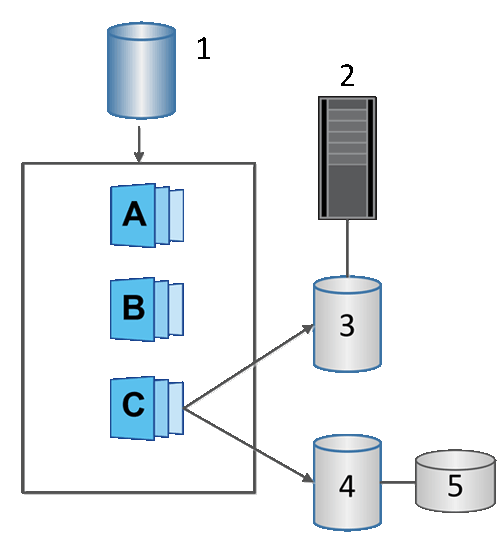

= SANtricityソフトウェアのスナップショットボリュームについて学ぶ
:allow-uri-read: 
:icons: font
:imagesdir: ../media/

[role="lead"]
Snapshotデータの読み取りまたは書き込みを行う場合は、Snapshotボリュームを作成してホストに割り当てることができます。Snapshotボリュームは、ベースボリュームと同じ特性（RAIDレベル、I/O特性など）を共有します。

作成したSnapshotボリュームは、____トク ミシユリ_onl_yまたは_read-write accessible _として指定できます。

読み取り専用のSnapshotボリュームを作成する場合、リザーブ容量を追加する必要はありません。読み書き可能Snapshotボリュームを作成する場合は、リザーブ容量を追加して書き込みアクセスを許可する必要があります。

^1基本ボリューム；^2^ホスト；^3^読み取り専用Snapshotボリューム；^4^読み取り/書き込みSnapshotボリューム；^5^リザーブ容量
